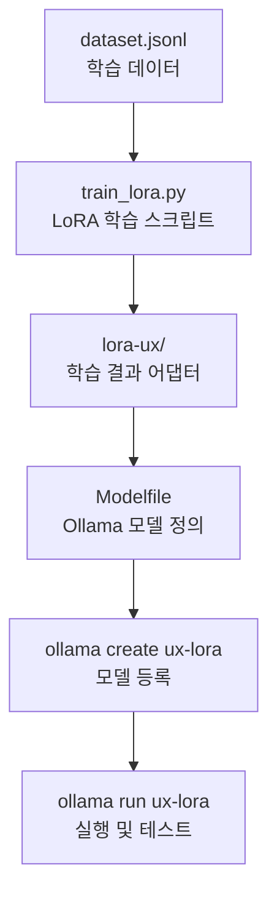

# fine_tune

# 🧠 LoRA Fine-Tuning & Ollama Integration

이 프로젝트는 **Hugging Face PEFT**를 이용해 LoRA 어댑터를 학습시키고,  
학습된 모델을 **Ollama**에서 불러와 로컬 환경에서 실행하는 과정을 포함합니다.

---

## 📌 개요

- **목적**: 대형 언어 모델(LLM)을 직접 재학습하지 않고,  
  경량 LoRA 튜닝을 통해 특정 도메인 지식(UX, 교육, 감정형 대화 등)을 주입하는 것
- **결과물**: `adapter_model.safetensors` 형태의 LoRA 어댑터 파일
- **활용**: Ollama의 `Modelfile`에 연결해 새로운 맞춤형 LLM으로 실행 가능

---

## ⚙️ 개발 환경

| 항목        | 버전 / 도구                                                      |
| ----------- | ---------------------------------------------------------------- |
| macOS       | Sonoma / Apple Silicon (M1~M3)                                   |
| Python      | 3.9 이상                                                         |
| pip         | 25.2 (가상환경 내)                                               |
| 주요 패키지 | `transformers`, `peft`, `datasets`, `accelerate`, `bitsandbytes` |
| 모델        | Mistral-7B, Llama 3, Phi 3 등 지원                               |
| Ollama      | v0.12.3 (Stable)                                                 |

---

## 🧱 프로젝트 구조

```bash
fine_tune/
├── venv/                            # Python 가상환경
├── dataset.jsonl                    # 학습 데이터 (prompt-response 쌍)
├── train_lora.py                    # LoRA 학습 스크립트
├── lora-ux/                         # 학습 결과 (LoRA 어댑터)
│   ├── adapter_model.safetensors
│   ├── adapter_config.json
│   └── metadata.json
├── Modelfile                        # Ollama용 모델 정의 파일
├── .gitignore                       # Git 추적 제외 설정
└── requirements.txt                 # 의존성 관리 (선택)
```

## 🔁 학습 및 실행 흐름



## ✅ 학습 → Ollama 실행 순서 (요약)

### 1. 가상환경 활성화

source venv/bin/activate

### 2. 의존성 설치

pip install -r requirements.txt

### 3. LoRA 학습 실행

python train_lora.py

### 4. Ollama 모델 조립

ollama create ux-lora -f Modelfile

### 5. 모델 실행 테스트

ollama run ux-lora
